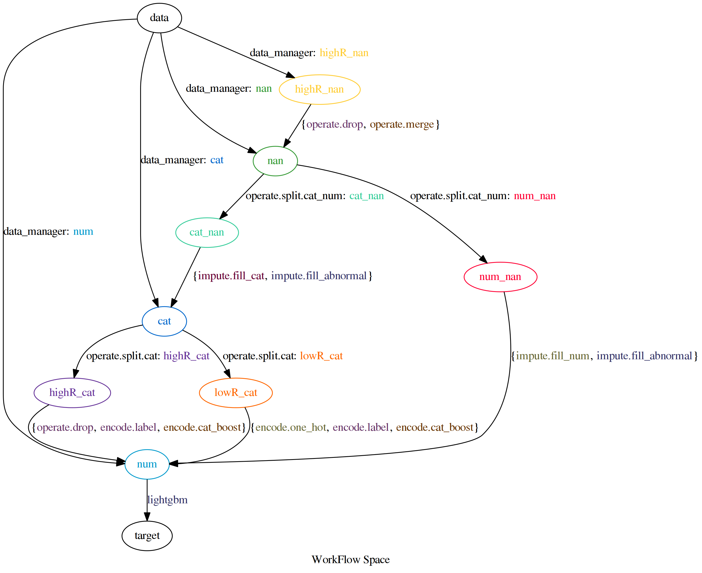

==========
AutoFlow
==========

``AutoFlow`` : **Automatic machine learning workflow modeling platform**

Introduction
--------------

In the problem of data mining and machine learning of tabular data,
data scientists usually group the features, construct a directed acyclic graph (DAG),
and form a machine learning workflow.

In each directed edge of this directed acyclic graph, 
the tail node represents the feature group before preprocessing, 
and the head node represents the feature group after preprocessing. 
Edge representation data processing or feature engineering algorithms, 
in each edge algorithm selection and hyper-parameter optimization are doing.

Unfortunately, if data scientists want to manually select algorithms and 
hyper-parameters for such a workflow, 
it will be a very tedious task. In order to solve this problem, 
we developed the ``Hyperflow``, 
which can automatically select algorithm and optimize the parameters of 
machine learning workflow. 
In other words, it can implement AutoML for tabular data.

Documentation
--------------

The documentation can be found `here <https://auto-flow.github.io/autoflow/>`_.

Installation
--------------

Requirements
~~~~~~~~~~~~~~

This project is built and test on Linux system, so Linux platform is required. 
If you are using Windows system, `WSL <https://docs.microsoft.com/en-us/windows/wsl/install-win10>`_ is worthy of considerarion.

Besides the listed requirements (see requirements.txt), the `random forest <https://github.com/automl/random_forest_run>`_ 
used in `SMAC3 <https://github.com/automl/SMAC3>`_ requires 
`SWIG <http://www.swig.org/>`_ (>= 3.0, <4.0) as a build dependency. 
If you are using Ubuntu or another Debain Linux, you can enter following command :

::

    apt-get install swig

On Arch Linux (or any distribution with swig4 as default implementation):

::

    pacman -Syu swig3
    ln -s /usr/bin/swig-3 /usr/bin/swig

AutoFlow requires `Python <https://www.python.org/>`_ 3.6 or higher.

Installation via pip
~~~~~~~~~~~~~~~~~~~~~~~~~~~~

::

    pip install auto-flow

Manual Installation
~~~~~~~~~~~~~~~~~~~~~~~~~~~~

::

    git clone https://github.com/auto-flow/autoflow.git && cd autoflow
    python setup.py install

Quick Start
--------------

`Titanic <https://www.kaggle.com/c/titanic>`_ is perhaps the most familiar machine learning task for data scientists. 
For tutorial purposes, you can find titanic dataset in ``examples/data/train_classification.csv`` and
``examples/data/test_classification.csv`` . 
You can use AutoFlow to finish this ML task instead of manually exploring all the features of the dataset. DO IT !

.. code-block:: bash

   $ cd examples/classification

.. code-block:: python

    import os

    import joblib
    import pandas as pd
    from sklearn.model_selection import KFold

    from autoflow import AutoFlowClassifier

    # load data from csv file
    train_df = pd.read_csv("../data/train_classification.csv")
    test_df = pd.read_csv("../data/test_classification.csv")
    # initial_runs  -- initial runs are totally random search, to provide experience for SMAC algorithm.
    # run_limit     -- is the maximum number of runs.
    # n_jobs        -- defines how many search processes are started.
    # included_classifiers -- restrict the search space . lightgbm is the only classifier that needs to be selected
    # per_run_time_limit -- restrict the run time. if a trial during 60 seconds, it is expired, should be killed.
    trained_pipeline = AutoFlowClassifier(initial_runs=5, run_limit=10, n_jobs=1, included_classifiers=["lightgbm"],
                                        per_run_time_limit=60)
    # describing meaning of columns. `id`, `target` and `ignore` all has specific meaning
    # `id` is a column name means unique descriptor of each rows,
    # `target` column in the dataset is what your model will learn to predict
    # `ignore` is some columns which contains irrelevant information
    column_descriptions = {
        "id": "PassengerId",
        "target": "Survived",
        "ignore": "Name"
    }
    if not os.path.exists("autoflow_classification.bz2"):
        # pass `train_df`, `test_df` and `column_descriptions` to classifier,
        # if param `fit_ensemble_params` set as "auto", Stack Ensemble will be used
        # ``splitter`` is train-valid-dataset splitter, in here it is set as 3-Fold Cross Validation
        trained_pipeline.fit(
            X_train=train_df, X_test=test_df, column_descriptions=column_descriptions,
            fit_ensemble_params=False,
            splitter=KFold(n_splits=3, shuffle=True, random_state=42),
        )
        # finally , the best model will be serialize and store in local file system for subsequent use
        joblib.dump(trained_pipeline, "autoflow_classification.bz2")
        # if you want to see what the workflow AutoFlow is searching, you can use `draw_workflow_space` to visualize
        hdl_constructor = trained_pipeline.hdl_constructors[0]
        hdl_constructor.draw_workflow_space()
    # suppose you are processing predict procedure, firstly, you should load serialized model from file system
    predict_pipeline = joblib.load("autoflow_classification.bz2")
    # secondly, use loaded model to do predicting
    result = predict_pipeline.predict(test_df)
    print(result)

